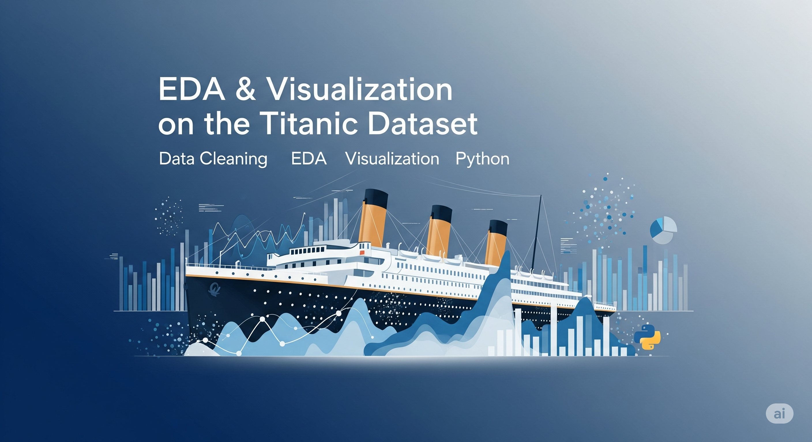

## 🚀 EDA & Visualization on the Titanic Dataset 📊🔍

</p>

## 📌 Project Overview
This project performs **Exploratory Data Analysis (EDA)** on the Titanic dataset to uncover patterns, relationships, and insights using Python and data visualization techniques.

## 📊 Key Steps
### **Dataset Loading & Exploration**
- Used Pandas to load and inspect the dataset.
- Checked for missing values, data types, and basic statistics.

### **Data Cleaning**
- Handled missing values using imputation or removal.
- Removed duplicate records.
- Identified and treated outliers using statistical techniques.

### **Data Visualization**
📊 Bar charts for categorical variables.
📈 Histograms for numerical distributions.
🔥 Correlation heatmap to understand feature relationships.

### **Insights & Observations**
- Summarized findings from the analysis.
- Most passengers were in **Third Class**.
- The **age distribution** shows a majority of passengers were between **20-40 years old**.
- The **heatmap** reveals a strong correlation between **fare and class** (First Class passengers paid more).
- Missing values in **age** and **embark_town** were successfully handled.

## 🛠 Tech Stack
- **Python 🐍**
- **Pandas, NumPy 📊**
- **Matplotlib, Seaborn 🎨**
- **Scikit-learn 🤖 (For future ML modeling)**

## 🚀 Setup Instructions
### **1️⃣ Install Anaconda (if not installed)**
Download and install [Anaconda](https://www.anaconda.com/) to use Jupyter Notebook.

### **2️⃣ Open Jupyter Notebook**
- Launch **Anaconda Navigator** and open **Jupyter Notebook**.
- Create a new **Python 3** notebook.

### **3️⃣ Install Required Libraries**
Run this command inside Jupyter Notebook:
```python
!pip install pandas numpy matplotlib seaborn
```

### **4️⃣ Load the Dataset**
```python
import pandas as pd
import seaborn as sns

# Load dataset
titanic = sns.load_dataset("titanic")

# Display first few rows
titanic.head()
```

## 📁 Project Structure
```
📂 Titanic-EDA
│── 📄 README.md
│── 📄 Titanic_EDA.ipynb
│── 📂 data (optional, if using Kaggle CSV)
│── 📂 images (optional, to store visualizations)
```

## 🌟 Future Improvements
- Perform **feature engineering** for machine learning models.
- Analyze survival rates based on **gender, class, and age**.
- Build a **predictive model** to classify survivors.

## 🤝 Acknowledgment
This project is part of my learning journey.
Big thanks to the **data science community** for support and guidance! 🙌

## 📜 License
This project is open-source and available under the **MIT License**.

## 💡 Contributing
Feel free to fork this repo, raise issues, and submit pull requests to improve the analysis.

---
**🔗 Connect with Me**: [LinkedIn](https://www.linkedin.com/) | [GitHub](https://github.com/) | [Twitter](https://twitter.com/)

#DataScience #EDA #Python #MachineLearning #Visualization

